<h1 align="center">üç∫ IntuneBrew</h1>

<div align="center">
  <p>
    <a href="https://twitter.com/UgurKocDe">
      
    </a>
    <a href="https://www.linkedin.com/in/ugurkocde/">
      
    </a>
    
  </p>
  <p>
  <p>
    <a href="https://www.powershellgallery.com/packages/IntuneBrew">
      
    </a>
    <a href="https://www.powershellgallery.com/packages/IntuneBrew">
      
    </a>
                                                                                                                                                                                                                                                                                                <p>
    <a href="#-supported-applications">
      
    </a>
  </p>
</div>

IntuneBrew is a PowerShell-based tool that simplifies the process of uploading and managing macOS applications in Microsoft Intune. It automates the entire workflow—from downloading apps to uploading them to Intune with proper metadata and icons.

This project uses publicly available metadata from Homebrew’s JSON API. Homebrew is a registered trademark of its respective owners and is not affiliated with or endorsing this project.

## Watch the full walkthrough of the tool:

<div align="center">
      <a href="https://www.youtube.com/watch?v=7NEs-EnvmII">
     
      </a>
</div>

## Table of Contents

- [Watch the full walkthrough of the tool:](#watch-the-full-walkthrough-of-the-tool)
- [Table of Contents](#table-of-contents)
- [üö® Public Preview Notice](#-public-preview-notice)
- [🔄 Latest Updates](#-latest-updates)
- [‚ú® Features](#-features)
- [üöÄ Getting Started](#-getting-started)
  - [Prerequisites](#prerequisites)
- [üìù Usage](#-usage)
  - [Basic Usage](#basic-usage)
  - [üì± Supported Applications](#-supported-applications)
- [üîß Configuration](#-configuration)
  - [Using System Managed Identity](#using-system-managed-identity)
  - [Using User Assigned Managed Identity](#using-user-assigned-managed-identity)
  - [Using ClientSecret from Entra ID App Registration](#using-clientsecret-from-entra-id-app-registration)
  - [Certificate-Based Authentication](#certificate-based-authentication)
  - [Copy Assignments](#copy-assignments)
  - [App JSON Structure](#app-json-structure)
- [🔄 Version Management](#-version-management)
- [🛠️ Error Handling](#️-error-handling)
- [🤔 Troubleshooting](#-troubleshooting)
  - [Common Issues](#common-issues)
- [🤝 Contributing](#-contributing)
- [üìú License](#-license)
- [üôè Acknowledgments](#-acknowledgments)
- [üìû Support](#-support)

## üö® Public Preview Notice

> [!IMPORTANT]
> üöß **Public Preview Notice**
>
> IntuneBrew is currently in Public Preview. While it's fully functional, you might encounter some rough edges. Your feedback and contributions are crucial in making this tool better!
>
> - üìù [Submit Feedback](https://github.com/ugurkocde/IntuneBrew/issues/new?labels=feedback)
> - üêõ [Report Bugs](https://github.com/ugurkocde/IntuneBrew/issues/new?labels=bug)
> - üí° [Request Features](https://github.com/ugurkocde/IntuneBrew/issues/new?labels=enhancement)
>
> Thank you for being an early adopter! üôè


## 🔄 Latest Updates

*Last checked: 2025-05-09 13:44 UTC*

| Application | Previous Version | New Version |
|-------------|-----------------|-------------|
| Lens | 2025.4.92142 | 2025.5.81206 |
## ‚ú® Features

- üöÄ Automated app uploads to Microsoft Intune
- 📦 Supports both .dmg and .pkg files
- 🔄 Automatic version checking and updates
- 🖼️ Automatic app icon integration
- üìä Progress tracking for large file uploads
- üîê Secure authentication with Microsoft Graph API
- 🎯 Smart duplicate detection
- üí´ Bulk upload support
- 🔁 Automatic retry mechanism for failed uploads
- üîí Secure file encryption for uploads
- üìà Real-time progress monitoring

## üöÄ Getting Started

### Prerequisites

- PowerShell 7.0 or higher
- Administrator rights (script must be installed as administrator, specially if you use "Install-Script IntuneBrew -Force")
- Microsoft.Graph.Authentication Module must be installed
- Azure App Registration with appropriate permissions OR Manual Connection via Interactive Sign-In
- Windows or macOS operating system

## üìù Usage

### Basic Usage

Download the script: IntuneBrew.ps1

Run the script:

```powershell
.\IntuneBrew.ps1
```

Follow the interactive prompts to:

1. Select which apps to upload
2. Authenticate with Microsoft Graph
3. Monitor the upload progress
4. View the results in Intune

### üì± Supported Applications

| Application | Latest Version |
|-------------|----------------|
|  1Password | 8.10.75 |
| 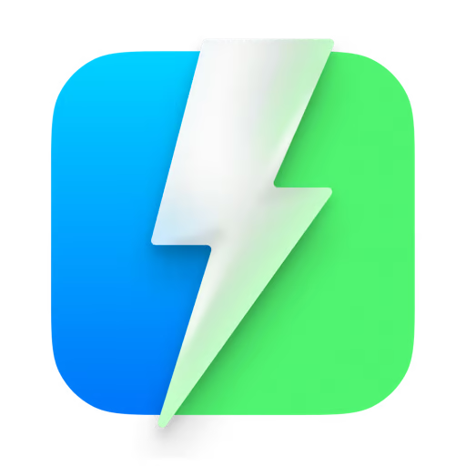 A Better Finder Rename | 12.12 |
| 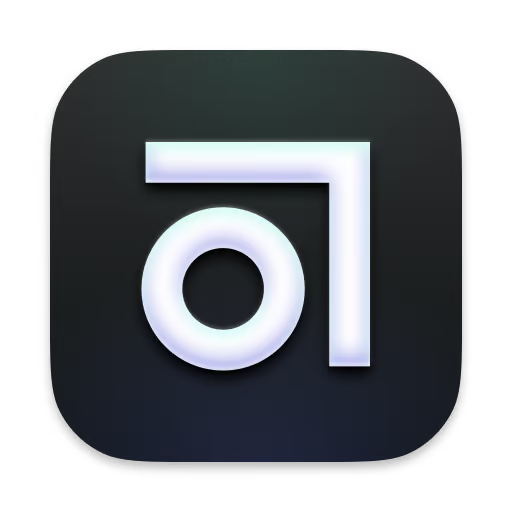 Abstract | 98.6.1 |
|  Acorn | 8.1.1 |
|  Acronis True Image | 29.2 |
|  AdGuard | 2.16.4.1870 |
|  Adobe Acrobat Pro DC | 25.001.20476 |
|  Adobe Acrobat Reader | 25.001.20467 |
|  Adobe Creative Cloud | 6.6.0.611 |
|  Advanced Renamer | 4.11 |
| 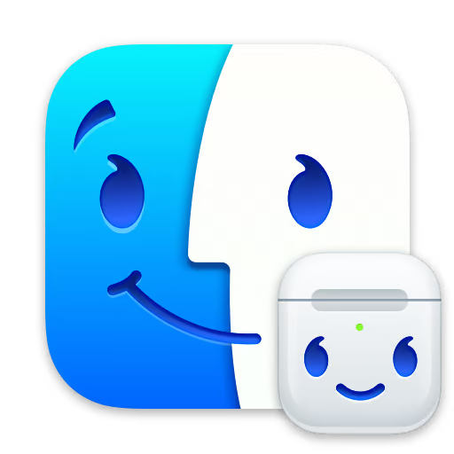 AirBuddy | 2.7.3 |
|  Aircall | 3.1.66 |
|  Airfoil | 5.12.4 |
|  AirParrot | 3.1.7 |
|  Airtable | 1.6.6 |
|  Airy | 3.29.2 |
|  Alacritty | 0.15.1 |
| 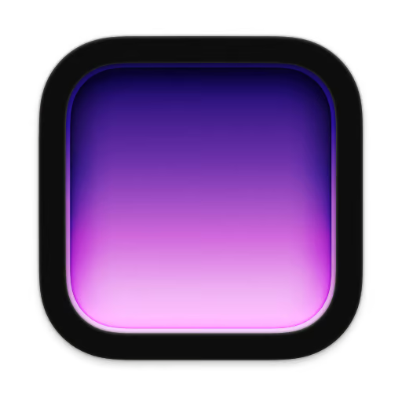 Alcove | 1.2.5 |
|  Alfred | 5.6.1 |
|  AltTab | 7.24.0 |
|  Amadine | 1.6.7 |
|  Amazon Chime | 5.23.22318 |
|  Amazon Q | 1.9.1 |
|  Android Studio | 2024.3.2.14 |
|  Angry IP Scanner | 3.9.1 |
|  Anki | 25.02.4 |
| 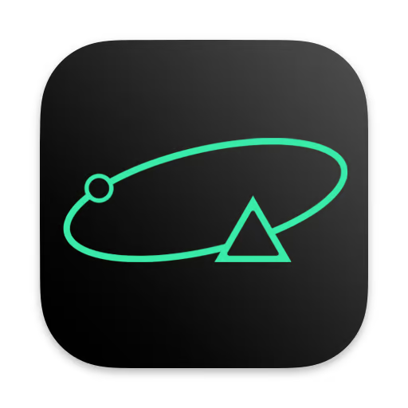 Antinote | 1.1.5 |
|  Any.do | 5.0.68 |
|  AnyDesk | 9.0.2 |
|  Apidog | 2.7.8 |
|  Apifox | 2.7.9 |
|  Apparency | 2.2 |
|  Arc | 1.94.0 |
| 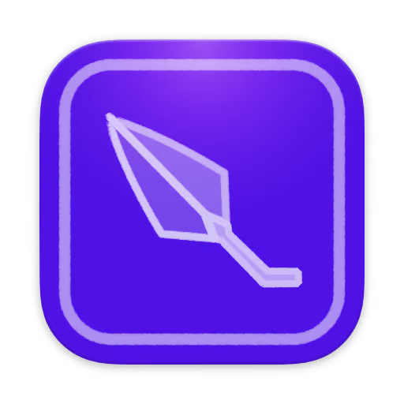 Archaeology | 1.2 |
|  Arduino IDE | 2.3.6 |
|  Asana | 2.4.0 |
| 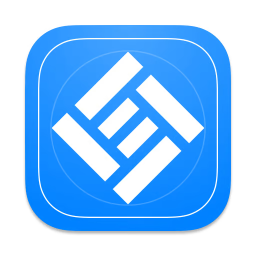 Asset Catalog Tinkerer | 2.9 |
|  Atlassian SourceTree | 4.2.11 |
|  Audacity | 3.7.3 |
|  Audio Hijack | 4.5.0 |
|  Autodesk Fusion 360 | latest |
|  AWS Client VPN | 5.2.0 |
|  AWS Corretto JDK | 21.0.7.6.1 |
|  Azul Zulu Java Standard Edition Development Kit | 24.0.1 |
|  Azure Data Studio | 1.51.1 |
|  Background Music | 0.4.3 |
|  Badgeify | 1.6.3 |
|  Bambu Studio | 02.00.03.54 |
|  Bartender | 5.3.5 |
|  Basecamp | 3 |
| 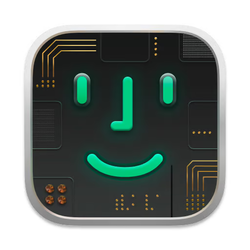 BatFi | 2.4.1 |
|  BBEdit | 15.1.4 |
|  Beeper | 4.0.661 |
|  BetterDisplay | 3.5.5 |
|  BetterMouse | 1.6 |
|  BetterTouchTool | 5.372 |
|  BetterZip | 5.3.4 |
|  Beyond Compare | 5.0.7.30840 |
| 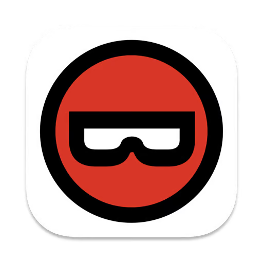 Binary Ninja | 5.0.7290 |
|  Bitwarden | 2025.4.2 |
| 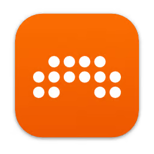 Bitwig Studio | 5.3.8 |
|  Blender | 4.4.3 |
|  BLEUnlock | 1.12.2 |
|  blip | 1.1.7 |
|  Blizzard Battle.net | 1.18.10.3141 |
| 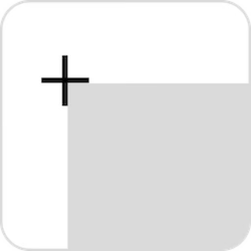 BlurScreen | 1.0 |
|  BoltAI | 1.35.2 |
|  Bome Network | 1.6.0 |
|  Boop | 1.4.0 |
|  Boxcryptor | 3.13.680 |
|  Brave | 1.78.97.0 |
|  BreakTimer | 1.3.2 |
|  Bruno | 2.2.0 |
|  BusyCal | 2025.2.1 |
|  BusyContacts | 2025.2.1 |
|  Caffeine | 1.5.1 |
|  calibre | 8.4.0 |
|  Calmly Writer | 2.0.59 |
|  Camtasia | 25.1.0 |
|  Canva | 1.107.0 |
|  CapCut | 3.3.0.1159 |
|  ChatGPT | 1.2025.119 |
|  ChatWise | 0.8.49 |
|  Chrome Remote Desktop | 136.0.7103.19 |
|  Cisco Jabber | 20250430033337 |
|  Citrix Workspace | 25.03.0.95 |
|  Claude | 0.9.3 |
|  CleanMyMac | 5.0.8 |
|  CleanShot | 4.7.6 |
|  CLion | 2025.1.1 |
|  Clipy | 1.2.1 |
| 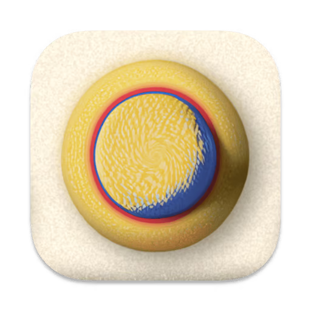 Clop | 2.9.2 |
|  Cloudflare WARP | 2025.2.664.0 |
|  CodeEdit | 0.3.4 |
|  CodeRunner | 4.4.1 |
|  Company Portal | 5.2502.1 |
|  Copilot for Xcode | 0.35.7 |
| 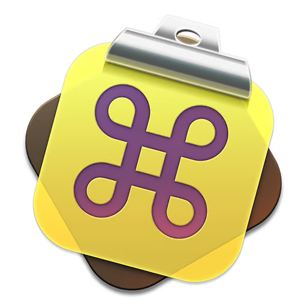 CopyClip | 2.9.99.2 |
|  CopyQ | 10.0.0 |
|  CotEditor | 5.1.6 |
|  Cryptomator | 1.16.1 |
|  Crystalfetch | 2.2.0 |
|  Cursor | 0.49.6 |
|  Cyberduck | 9.1.4 |
|  DaisyDisk | 4.31 |
|  Dangerzone | 0.9.0 |
|  Dataflare | 1.9.5 |
|  DataGrip | 2025.1.2 |
|  DataSpell | 2025.1 |
|  DB Browser for SQLite | 3.13.1 |
|  DBeaver Community Edition | 25.0.4 |
|  DbGate | 6.4.1 |
|  DeepL | 25.4.11926442 |
| 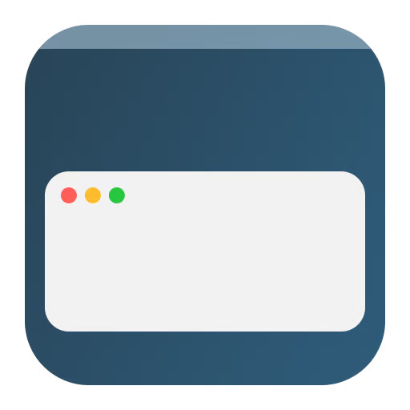 DeskPad | 1.3.2 |
|  DevToys | 2.0.8.0 |
|  DevUtils | 1.17.0 |
|  Discord | 0.0.345 |
|  DisplayLink USB Graphics Software | 1.12.2 |
|  DockDoor | 1.8 |
|  Docker Desktop | 4.41.2 |
| 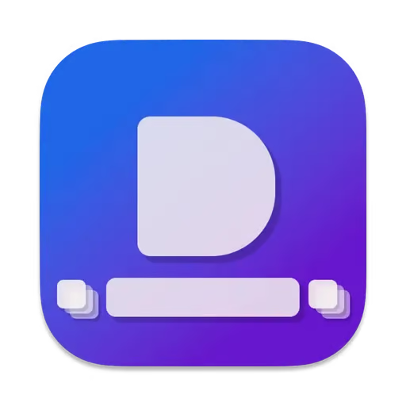 Dockside | 1.9.54 |
|  DOSBox | 0.74-3 |
|  Doughnut | 2.0.1 |
|  Downie | 4.9.15 |
|  draw.io Desktop | 26.2.15 |
|  DrawBot | 3.132 |
|  DriveDX | 1.12.1 |
|  Dropbox | 223.4.4909 |
|  DropDMG | 3.6.8 |
|  Dropshare | 6.3 |
|  DuckDuckGo | 1.137.0 |
|  Easydict | 2.14.1 |
|  EasyFind | 5.0.2 |
|  Eclipse Temurin Java Development Kit | 24.0.1 |
| 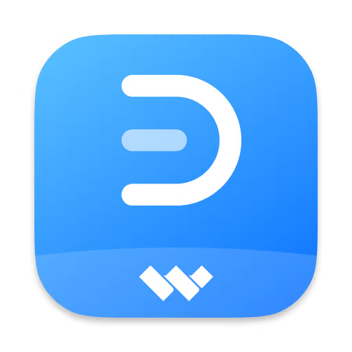 EdrawMax | 12.6.1 |
|  Elephas | 11.1086 |
|  Elgato Camera Hub | 2.0.0.5750 |
|  Elgato Capture Device Utility | 1.3.1 |
|  Elgato Stream Deck | 6.9.0.21694 |
|  Elgato Wave Link | 2.0.6.3780 |
|  Ente | 1.7.12 |
| 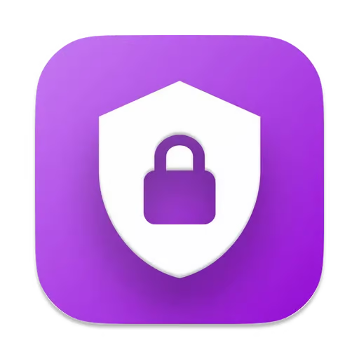 Ente Auth | 4.3.5 |
|  Epic Games Launcher | 18.5.0 |
|  Espanso | 2.2.1 |
|  Etcher | 2.1.2 |
|  Evernote | 10.105.4 |
|  f.lux | 42.2 |
|  Facebook Messenger | 233.1.0.8.208 |
|  Fantastical | 4.0.11 |
| 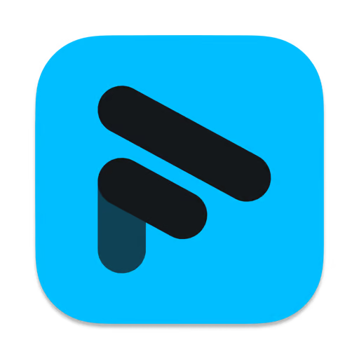 Fathom | 1.39.0 |
|  Figma | 125.4.8 |
|  Fission | 2.8.8 |
|  Flameshot | 12.1.0 |
| 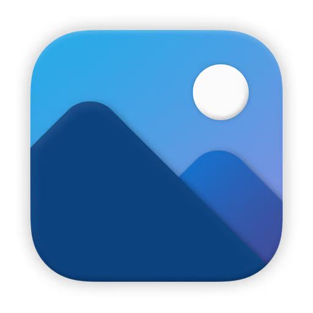 FlowVision | 1.6.2 |
|  Flycut | 1.9.6 |
|  Forecast | 0.9.6 |
|  Foxit PDF Editor | 13.1.7 |
|  Free Ruler | 2.0.8 |
|  FreeCAD | 1.0.0 |
|  Freelens | 1.2.1 |
|  FreeMacSoft AppCleaner | 3.6.8 |
|  FreeTube | 0.23.5 |
|  FSMonitor | 1.2 |
| 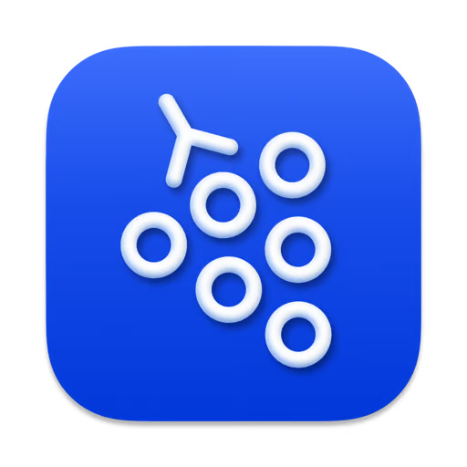 Gather Town | 1.31.0 |
|  Geany | 2.0 |
|  Geekbench | 6.4.0 |
|  Geekbench AI | 1.3.0 |
|  Gemini | 2.9.11 |
|  Gephi | 0.10.1 |
|  Ghostty | 1.1.3 |
|  gifox | 2.6.5+0 |
|  GIMP | 3.0.2 |
|  Git Credential Manager | 2.6.1 |
|  GitFinder | 1.7.11 |
|  GitHub Desktop | 3.4.19-d147b1a3 |
|  GitKraken | 11.1.0 |
|  Godot Engine | 4.4.1 |
| 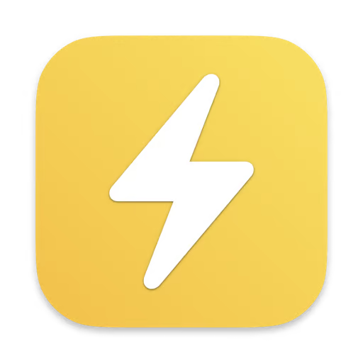 Godspeed | 1.8.92 |
|  Goland | 2025.1 |
|  Google Ads Editor | 2.9 |
|  Google Chrome | 136.0.7103.93 |
|  Google Drive | 107.0.3 |
|  Goose | 1.0.23 |
|  GPT fdisk | 1.0.10 |
|  Grammarly Desktop | 1.117.0.0 |
|  GrandPerspective | 3.5.3 |
|  Hammerspoon | 1.0.0 |
|  Hazel | 6.0.4 |
|  HazeOver | 1.9.4 |
|  Headlamp | 0.30.0 |
| 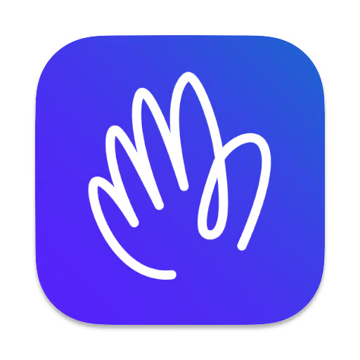 HEY | 1.2.17 |
|  Hidden Bar | 1.9 |
| 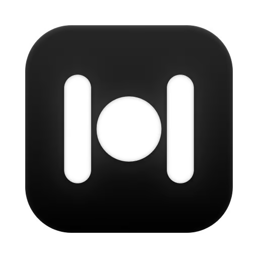 Highlight | 1.1.85 |
|  Home Assistant | 2025.3 |
|  Homerow | 1.4.0 |
|  HP Easy Admin | 2.15.0 |
| 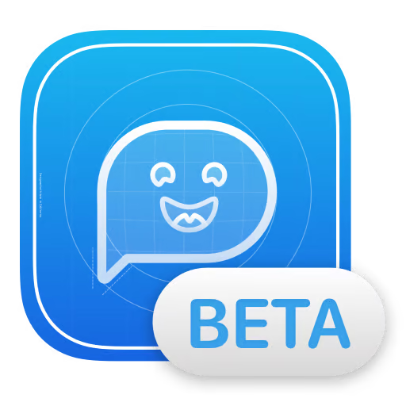 HuggingChat | 0.7.0 |
| 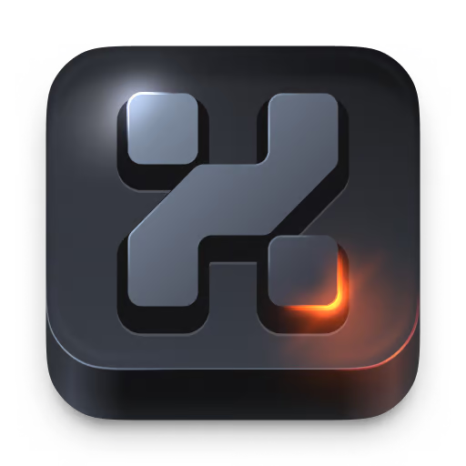 Huly | 0.6.499 |
|  Hyper | 3.4.1 |
| 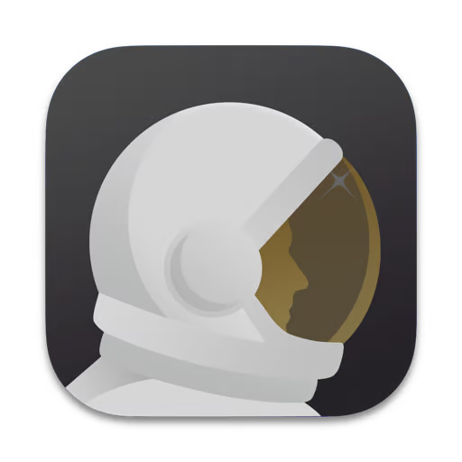 Hyperkey | 0.47 |
|  Ice | 0.11.12 |
|  IINA | 1.3.5 |
|  iMazing | 3.2.0 |
|  iMazing Profile Editor | 2.0.0 |
|  Inkscape | 1.4.028868 |
|  Insomnia | 11.1.0 |
|  Insta360 Studio | 5.6.1 |
|  IntelliJ IDEA Community Edition | 2025.1.1 |
| 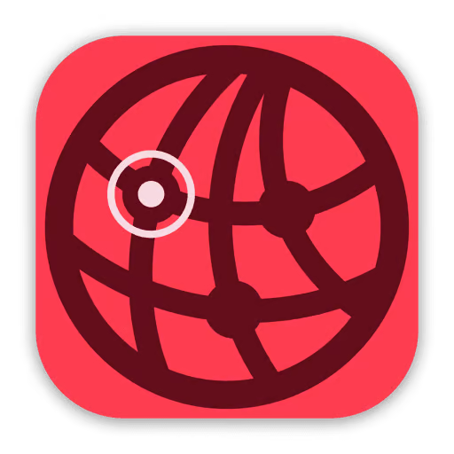 IsThereNet | 1.7.1 |
|  iTerm2 | 3.5.13 |
|  Itsycal | 0.15.6 |
|  Jabra Direct | 6.22.11401 |
| 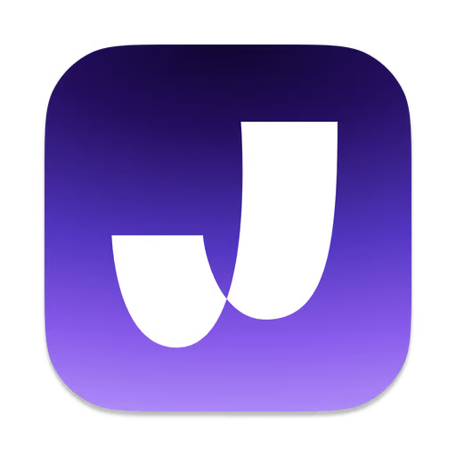 Jamie | 4.2.5 |
|  Jellyfin | 10.10.7 |
|  JetBrains PhpStorm | 2025.1.0.1 |
|  Jetbrains PyCharm Community Edition | 2025.1.1 |
|  JetBrains Rider | 2025.1.2 |
|  JetBrains Toolbox | 2.6.2 |
|  Joplin | 3.3.12 |
|  Jumpcut | 0.84 |
|  Jumpshare | 3.3.18 |
|  Kap | 3.6.0 |
|  Karabiner Elements | 15.3.0 |
|  KeePassXC | 2.7.10 |
|  Keeper Password Manager | 17.2 |
|  Keka | 1.4.8 |
|  Keybase | 6.5.1 |
|  KeyCastr | 0.10.3 |
|  KeyClu | 0.30.1 |
|  kitty | 0.41.1 |
|  Klokki | 1.3.7 |
|  Krisp | 3.1.6 |
|  Krita | 5.2.9 |
|  LangGraph Studio | 0.0.37 |
| 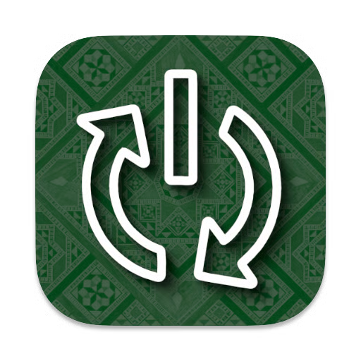 Last Window Quits | 1.1.4 |
|  Lens | 2025.5.81206 |
|  LibreOffice | 25.2.3 |
|  LibreWolf | 138.0.1 |
|  Little Snitch | 6.2.3 |
|  LM Studio | 0.3.15 |
|  Logitech G HUB | 2025.3.696161 |
|  Logitech Options+ | 1.89.705126 |
|  LookAway | 1.12.1 |
| 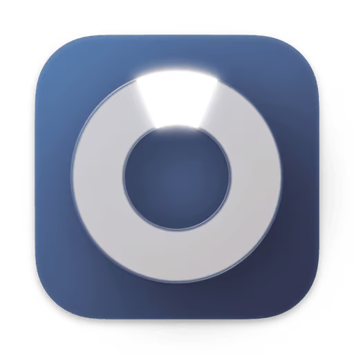 Loop | 1.2.0 |
|  LuLu | 3.1.5 |
| 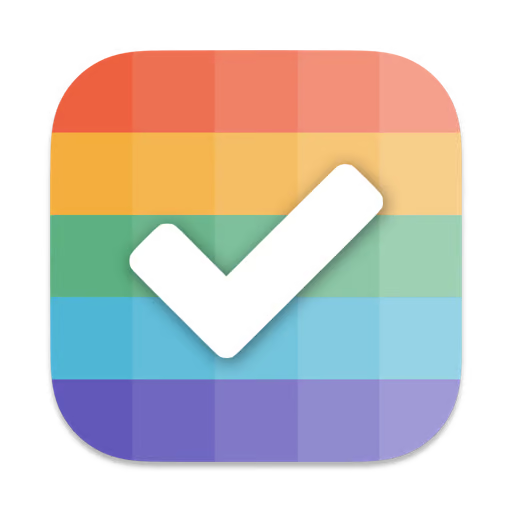 Lunatask | 2.0.22 |
|  LÖVE | 11.5 |
|  Maccy | 2.3.0 |
|  MacDown | 0.7.2 |
|  macFUSE | 4.10.2 |
|  MacPass | 0.8.1 |
|  Macs Fan Control | 1.5.17 |
|  MacTeX | 2025.0308 |
|  MacWhisper | 12.8 |
| 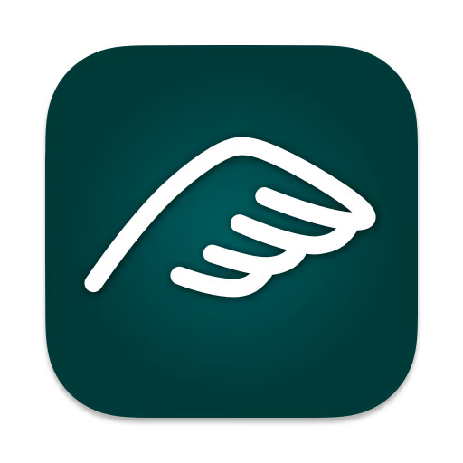 Maestral | 1.9.4 |
| 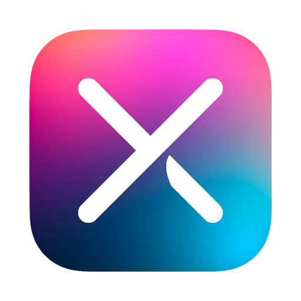 MagicQuit | 1.4 |
|  Malwarebytes for Mac | 5.13.4.2285 |
| 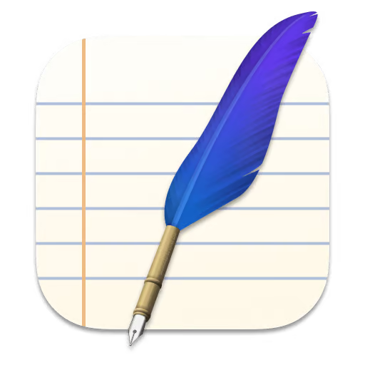 MarkEdit | 1.23.0 |
|  MarsEdit | 5.3.4 |
|  Marta File Manager | 0.8.2 |
|  Mattermost | 5.11.2 |
|  Medis | 2.15.1 |
|  MeetingBar | 4.10.0 |
|  Meld for macOS | 3.22.3+105 |
|  MenuBar Stats | 3.9 |
|  Metasploit Framework | 6.4.54 |
|  Micro Snitch | 1.6.1 |
|  Microsoft Auto Update | 4.79.25033028 |
|  Microsoft Azure Storage Explorer | 1.38.0 |
|  Microsoft Edge | 136.0.3240.64 |
|  Microsoft Office | 16.96.25041326 |
|  Microsoft Teams | 25093.2105.3614.8220 |
|  Microsoft Visual Studio Code | 1.100.0 |
| 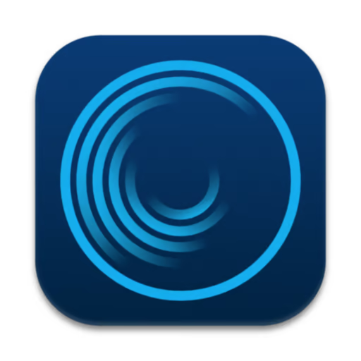 Middle | 1.9 |
| 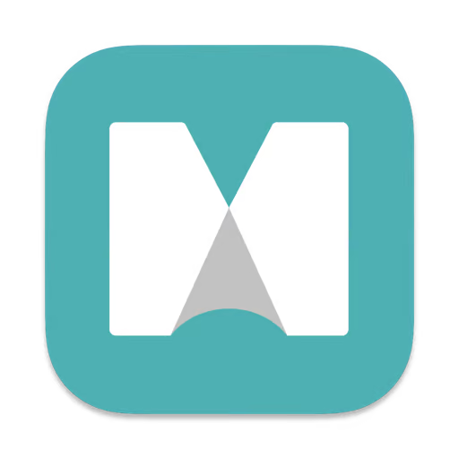 Mindmanager | 24.1.155 |
|  Miro | 0.10.96 |
|  Mist | 0.20.1 |
|  mitmproxy | 12.0.1 |
| 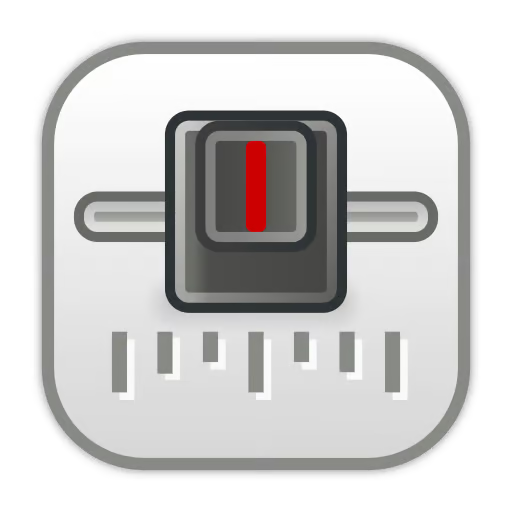 Mixxx | 2.5.1 |
|  Mobirise | 6.0.1 |
|  Mockoon | 9.2.0 |
|  MongoDB Compass | 1.46.1 |
|  MonitorControl | 4.3.3 |
|  Moonlight | 6.1.0 |
|  Mos | 3.5.0 |
|  Motrix | 1.8.19 |
|  Mountain Duck | 4.17.4 |
|  Mounty for NTFS | 2.4 |
|  mouseless | 0.3.1 |
|  Mozilla Firefox | 138.0.1 |
| 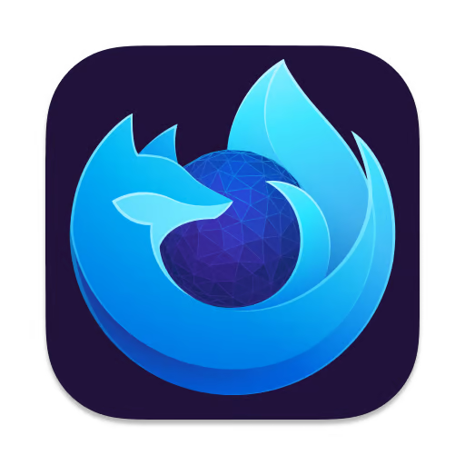 Mozilla Firefox Developer Edition | 139.0b5 |
| 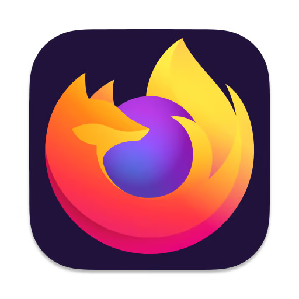 Mozilla Firefox ESR | 128.10.0 |
| 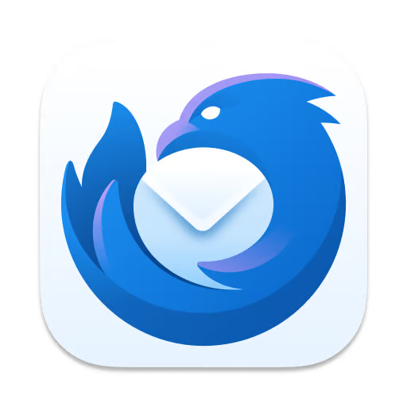 Mozilla Thunderbird | 138.0 |
| 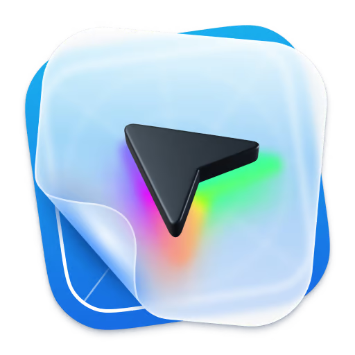 Multi | 0.538.2 |
|  MultiViewer for F1 | 1.43.2 |
| 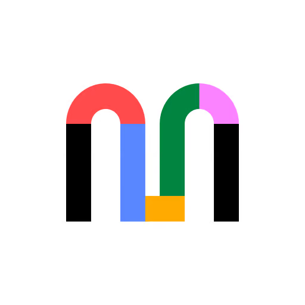 MURAL | 3.0.4 |
|  MySQL Workbench | 8.0.42 |
| 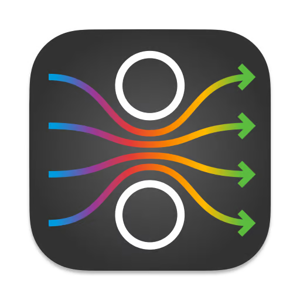 Name Mangler | 3.9.3 |
|  NeoFinder | 8.9 |
|  NetBeans IDE | 25 |
|  Netiquette | 2.3.0 |
|  NetNewsWire | 6.1.9 |
|  Nextcloud | 3.16.4 |
| 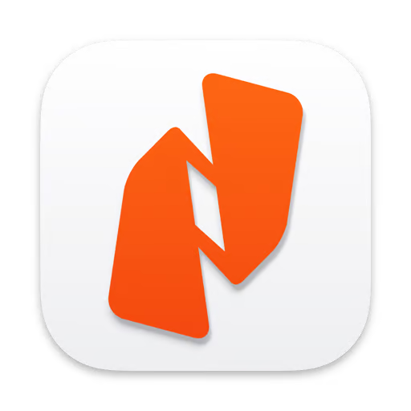 Nitro PDF Pro | 14.7 |
|  NoMachine | 8.16.1 |
| 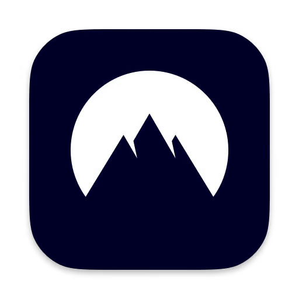 NordLayer | 3.6.0 |
| 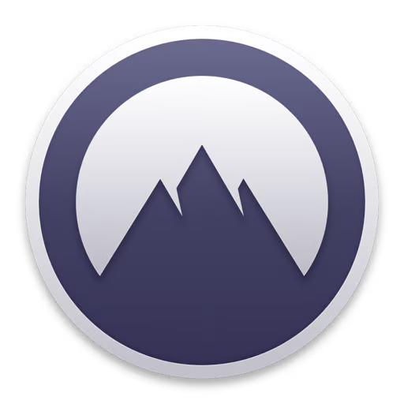 NordLocker | 4.26.1 |
| 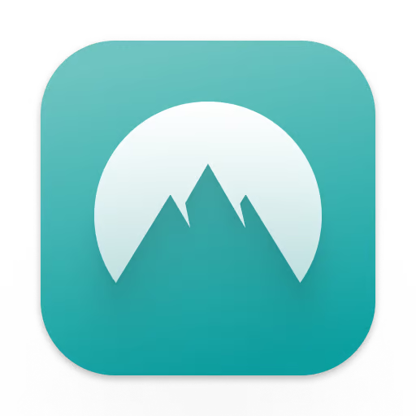 NordPass | 6.0.19 |
|  NordVPN | 8.37.0 |
| 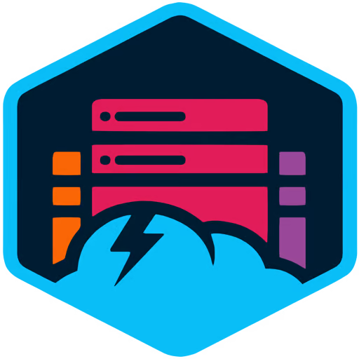 NoSQL Workbench | 3.13.5 |
|  Nota Gyazo GIF | 9.9.0 |
| 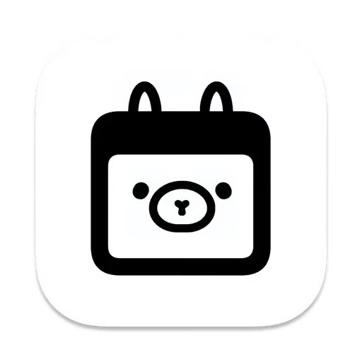 NotesOllama | 0.2.6 |
|  Notion | 4.10.0 |
|  Notion Calendar | 1.130.0 |
|  noTunes | 3.5 |
| 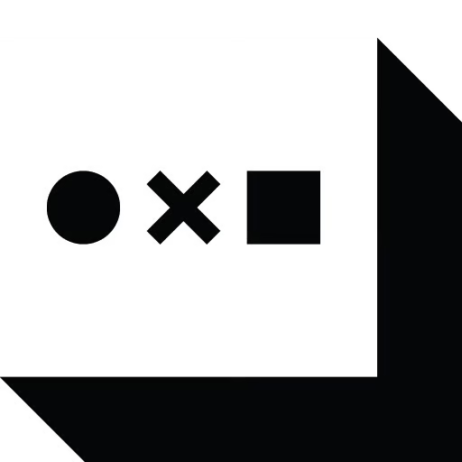 Noun Project | 2.3 |
| 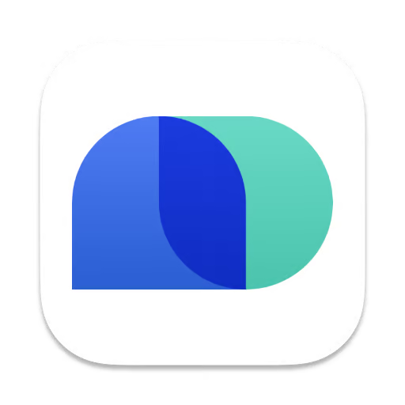 Novabench | 5.5.4 |
|  Nucleo | 4.1.6 |
| 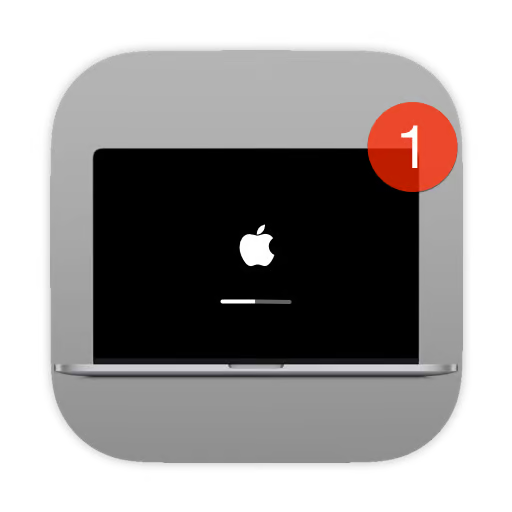 Nudge | 2.0.12.81807 |
|  NVIDIA GeForce NOW | 2.0.73.149 |
|  OBS | 31.0.3 |
|  Obsidian | 1.8.10 |
| 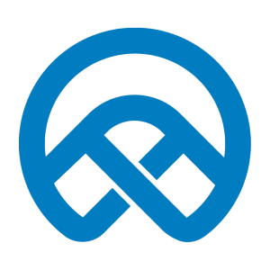 Okta Advanced Server Access | 1.89.1 |
|  Ollama | 0.6.8 |
|  OmniFocus | 4.5.3 |
|  OmniOutliner | 5.14.3 |
|  Omnissa Horizon Client | 2503-8.15.0-14236092062 |
|  OneDrive | 25.051.0317.0003 |
|  OnyX | 4.6.2 |
|  OpenVPN Connect client | 3.7.1 |
|  Opera | 118.0.5461.83 |
|  Oracle VirtualBox | 7.1.8 |
|  OrbStack | 1.10.3 |
|  Orca Slicer | 2.3.0 |
|  Orka CLI | 2.4.0 |
| 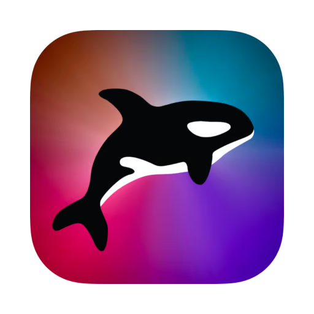 Orka Desktop | 3.0.0 |
| 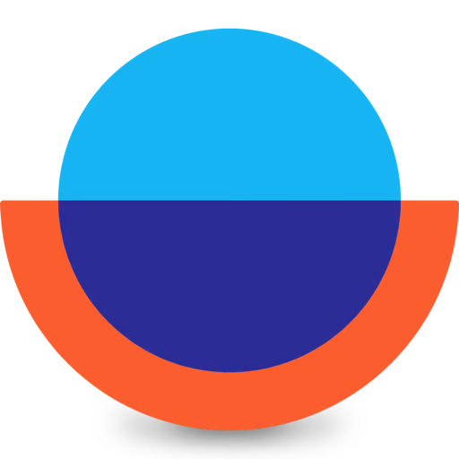 Overflow | 3.2.1 |
|  OverSight | 2.4.0 |
| 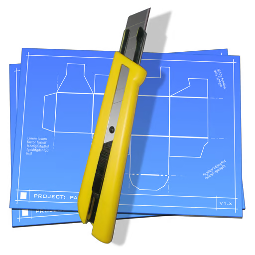 Packages | 1.2.10 |
|  Paintbrush | 2.6.0 |
| 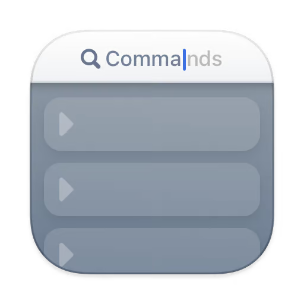 Paletro | 1.11.0 |
| 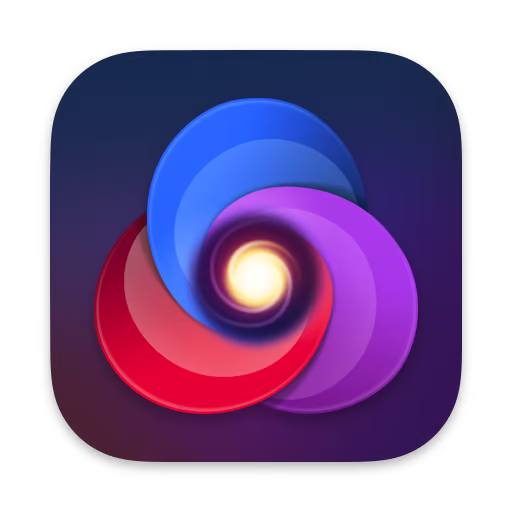 Panic Nova | 12.4 |
| 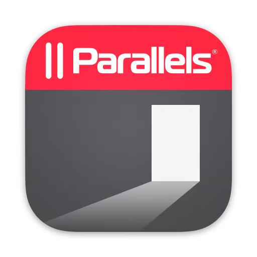 Parallels Client | 19.4.3 |
|  Parallels Desktop | 20.3.0-55895 |
|  Parsec | 150-98 |
|  Pastebot | 2.4.6 |
|  PDF Expert | 3.10.14 |
|  PDF Pals | 1.9.0 |
|  Pearcleaner | 4.4.3 |
|  pgAdmin4 | 9.3 |
| 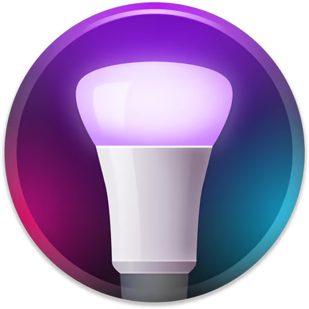 Philips Hue Sync | 1.12.1.65 |
|  Phoenix Slides | 1.5.9 |
|  Pika | 1.0.2 |
| 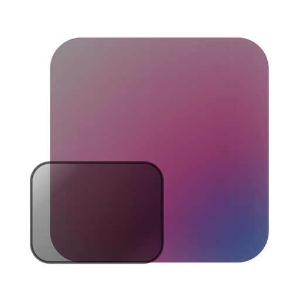 PiPHero | 1.2.0 |
| 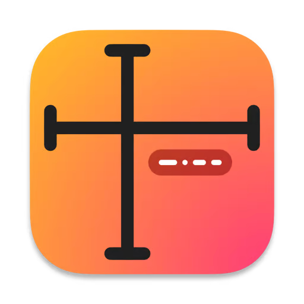 PixelSnap | 2.6.1 |
|  Platypus | 5.4.1 |
|  Plex | 1.108.1.307 |
|  PlistEdit Pro | 1.9.7 |
|  Podman Desktop | 1.18.0 |
|  PopChar X | 10.4 |
|  portx | 2.2.12 |
|  Postico | 2.1.2 |
|  Postman | 11.44.0 |
|  PowerShell | 7.5.1 |
|  Principle | 6.38 |
|  Privileges | 2.3.0 |
|  ProcessSpy | 1.6.7 |
|  ProNotes | 0.7.7 |
|  Proton Drive | 2.3.0 |
|  Proton Mail | 1.8.0 |
| 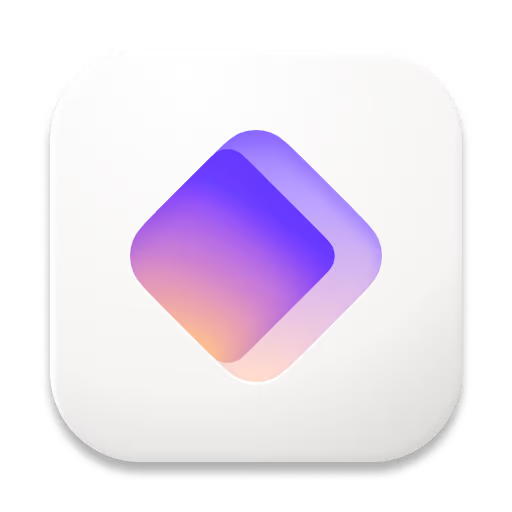 Proton Pass | 1.31.1 |
|  ProtonVPN | 4.8.0 |
|  Proxyman | 5.19.0 |
|  PS Remote Play | 8.0.0 |
| 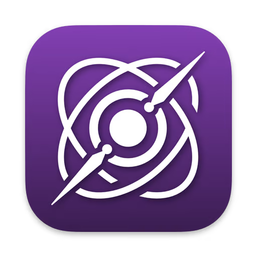 Pulsar | 1.128.0 |
| 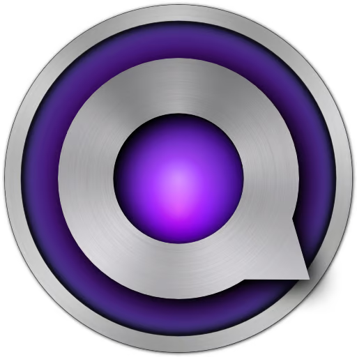 QLab | 5.4.10 |
|  QQ | 6.9.70 |
| 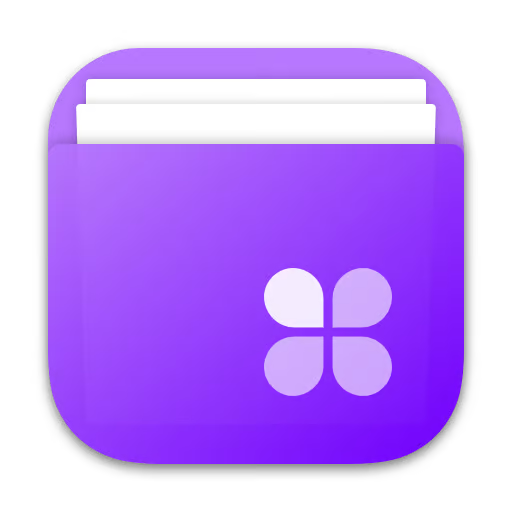 QSpace Pro | 5.3.4 |
|  quarto | 1.7.30 |
|  QuickLook Video | 2.21 |
|  qView | 6.1 |
| 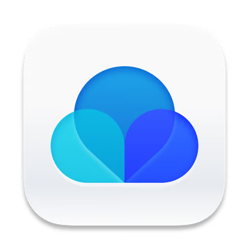 Raindrop.io | 5.6.76 |
|  Rancher Desktop | 1.18.2 |
|  Raycast | 1.97.1 |
|  Reactotron | 3.7.7 |
|  Readest | 0.9.40 |
|  Real VNC Viewer | 7.13.1 |
|  Rectangle | 0.87 |
| 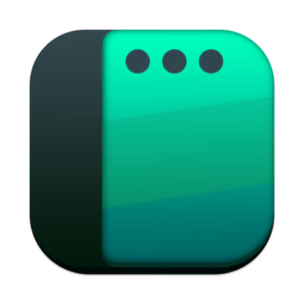 Rectangle Pro | 3.51 |
| 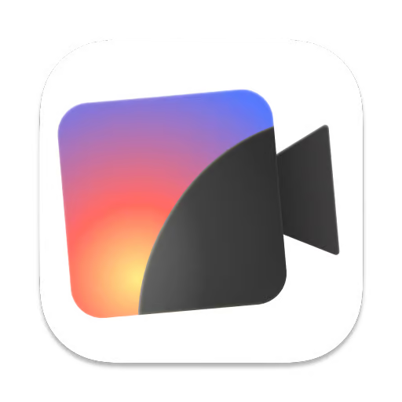 Recut | 2.1.7 |
|  Redis Insight | 2.68.0 |
| 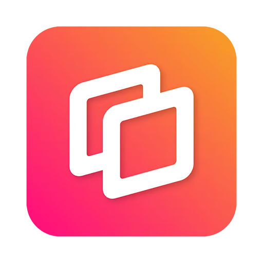 Reflector | 4.1.2 |
|  Remote Desktop Manager | 2025.1.16.3 |
|  Remote Help | 1.0.2404171 |
|  Reqable | 2.33.12 |
|  Requestly | 25.5.1 |
| 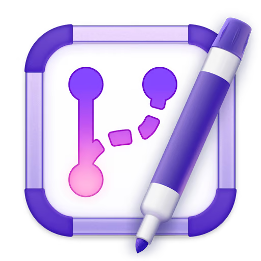 Retcon | 1.3.0 |
| 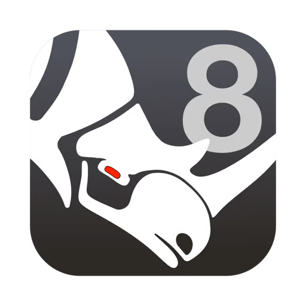 Rhinoceros | 8.18.25100.11002 |
| 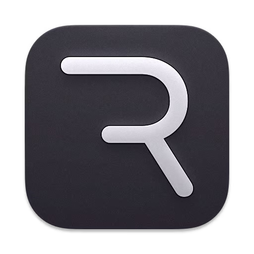 Rive | 0.8.2849 |
|  Rocket | 1.9.4 |
|  Rocket Typist | 3.2.2 |
|  Rocket.Chat | 4.3.3 |
| 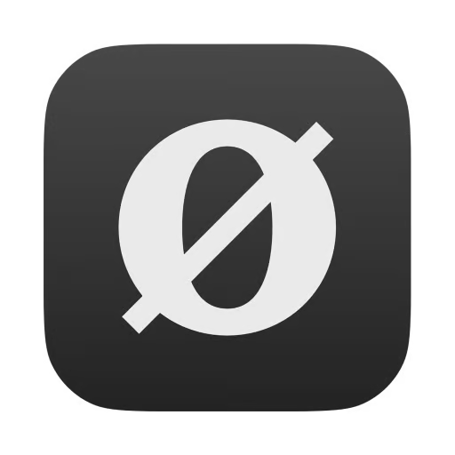 Rode Central | 2.0.94 |
| 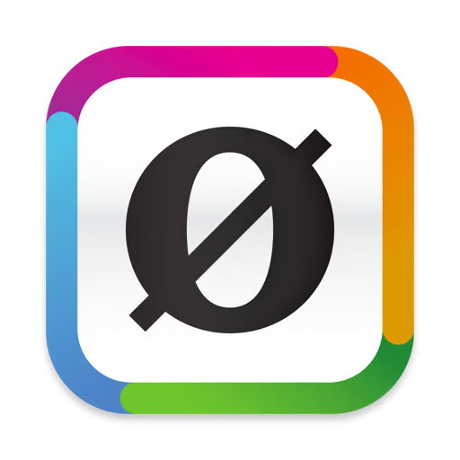 Rode Connect | 1.3.43 |
|  Rotato | 147 |
|  RStudio | 2025.05.0 |
| 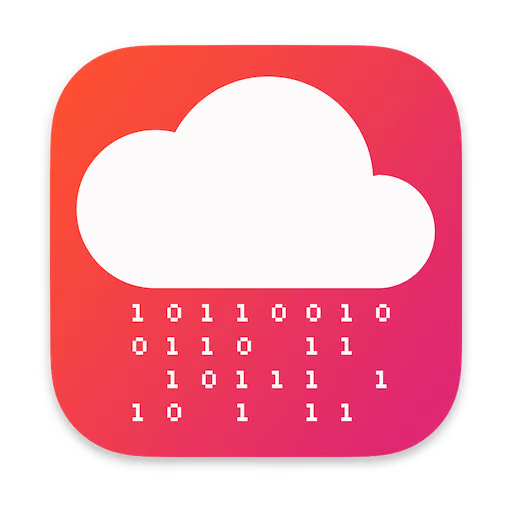 RsyncUI | 2.4.1 |
|  RustDesk | 1.3.9 |
|  SABnzbd | 4.5.1 |
|  Santa | 2025.4 |
|  ScreenFocus | 1.1.1 |
|  Sequel Ace | 5.0.7 |
|  Shottr | 1.8.1 |
|  Signal | 7.53.0 |
| 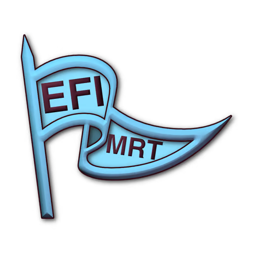 SilentKnight | 2.11 |
|  Sketch | 101.8 |
|  SketchUp | 2025.0.633.273 |
|  Skim | 1.7.9 |
|  Slack | 4.44.59 |
|  SmartBear SoapUI | 5.8.0 |
|  Snagit | 2025.2.0 |
| 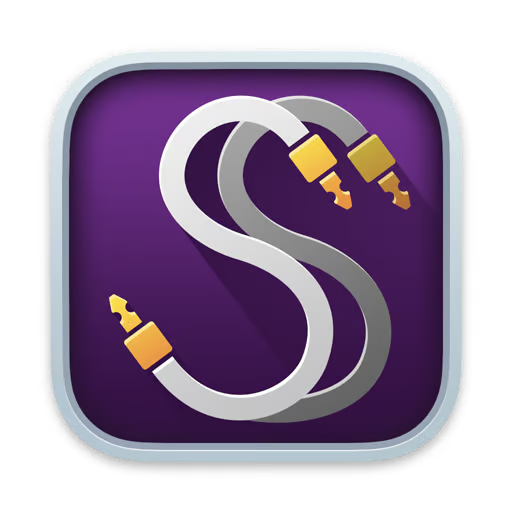 SoundSiphon | 3.8.2 |
|  Splashtop Business | 3.7.4.0 |
| 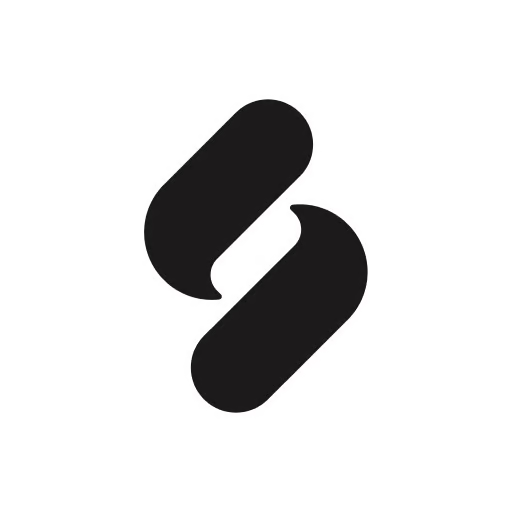 Splice | 5.3.2 |
|  Spline | 0.12.5 |
|  Spotify | 1.2.62.580 |
|  Sproutcube Shortcat | 0.12.0 |
| 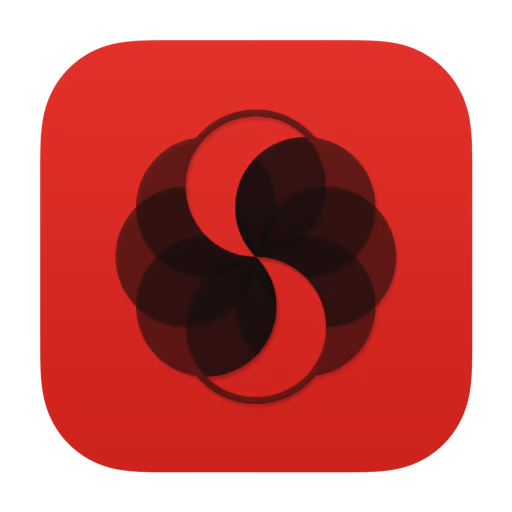 SQLPro for MSSQL | 2025.10 |
| 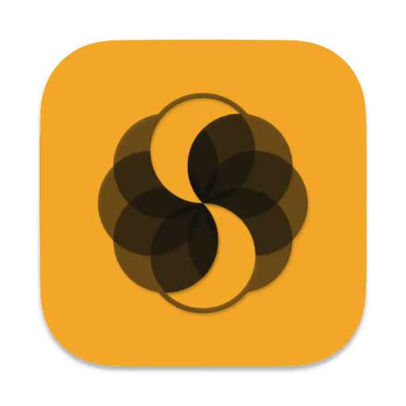 SQLPro for MySQL | 2025.10 |
| 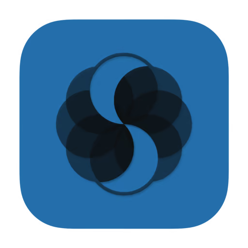 SQLPro for Postgres | 2025.06 |
| 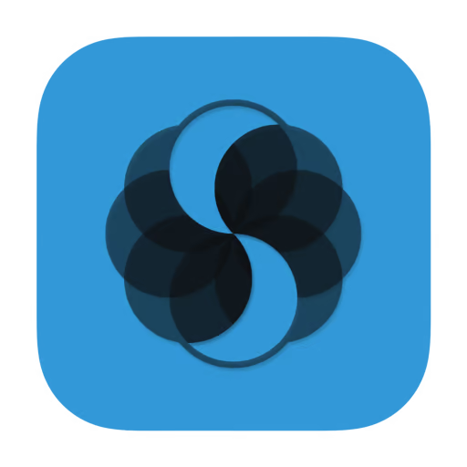 SQLPro for SQLite | 2025.07 |
| 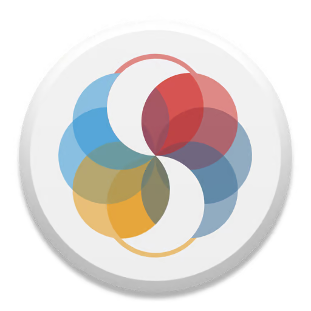 SQLPro Studio | 2025.10 |
|  Squirrel | 1.0.3 |
|  Stats | 2.11.42 |
|  Steam | 4.0 |
| 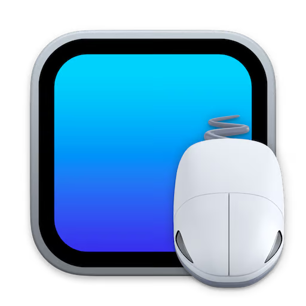 SteerMouse | 5.7.4 |
|  Stretchly | 1.17.2 |
| 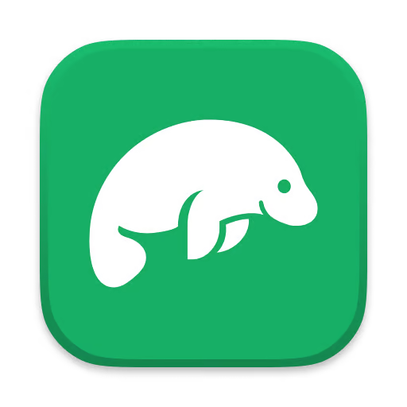 Studio 3T | 2025.8.0 |
|  Sublime Merge | 2102 |
|  Sublime Text | 4192 |
|  Superlist | 1.31.0 |
| 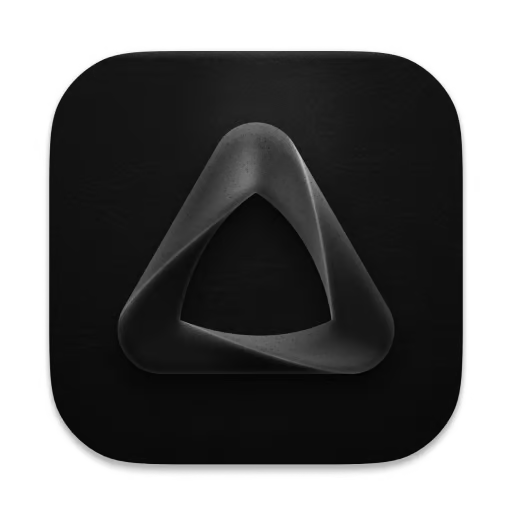 superwhisper | 1.45.14 |
|  Suspicious Package | 4.5 |
|  Swift Shift | 0.26.0 |
|  Sync | 2.2.48 |
|  Syncovery | 10.17.5 |
|  Synology Drive | 3.5.2 |
|  Tableau Desktop | 2025.1.1 |
| 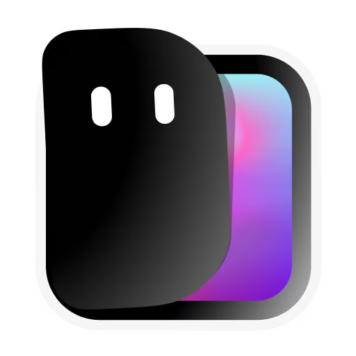 TabTab | 1.3.4 |
|  Tailscale | 1.82.5 |
| 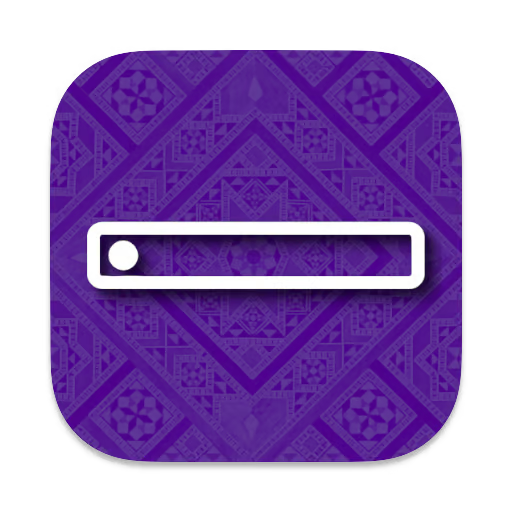 Taskbar | 1.4.3 |
| 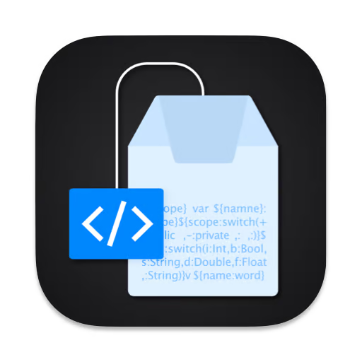 TeaCode | 1.1.3 |
|  TeamViewer Host | 15 |
|  TeamViewer QuickSupport | 15 |
|  Telegram for macOS | 11.11 |
|  Tenable Nessus Agent | 10.8.4 |
|  Termius | 9.19.4 |
|  TeX Live Utility | 1.54 |
|  TextMate | 2.0.23 |
|  Thonny | 4.1.7 |
|  Threema | 1.2.47 |
|  TigerVNC | 1.15.0 |
|  Todoist | 9.14.0 |
| 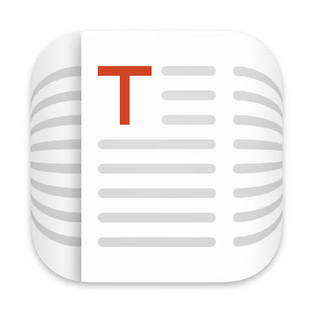 Tofu | 3.0.1 |
|  Topaz Gigapixel AI | 8.3.4 |
|  Trae | 1.0.12491 |
|  Transmission | 4.0.6 |
|  Transmit | 5.10.8 |
| 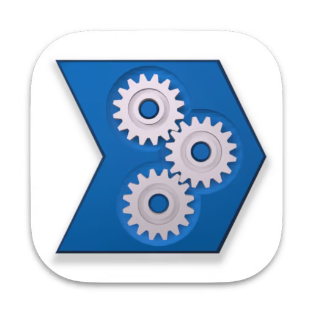 Transnomino | 9.2.2 |
|  Tunnelblick | 8.0 |
|  Twingate | 2025.114.13304 |
|  Typora | 1.10.10 |
|  UnnaturalScrollWheels | 1.3.0 |
| 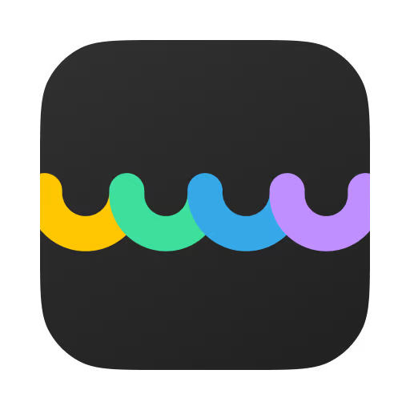 UPDF | 1.8.11 |
|  Upscayl | 2.15.0 |
|  UTM | 4.6.5 |
|  VeraCrypt | 1.26.20 |
| 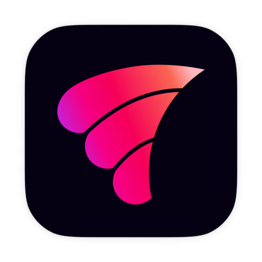 Vimcal | 1.0.35 |
|  VimR | 0.53.0 |
|  VisualVM | 2.2 |
|  Vivaldi | 7.3.3635.12 |
| 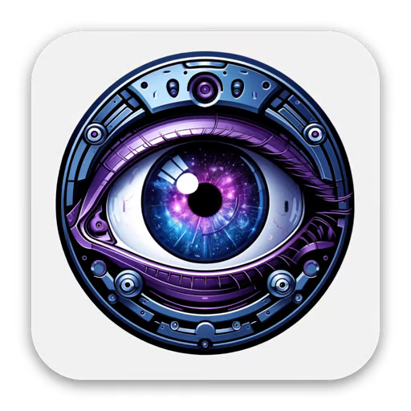 Viz | 2.2.1 |
|  VLC media player | 3.0.21 |
|  VSCodium | 1.100.03093 |
| 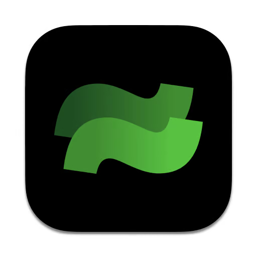 Wave Terminal | 0.11.3 |
|  Webex Teams | 45.4.1.32313 |
|  WebStorm | 2025.1.1 |
|  WeChat for Mac | 4.0.3.93 |
|  WhatsApp | 2.25.13.74 |
| 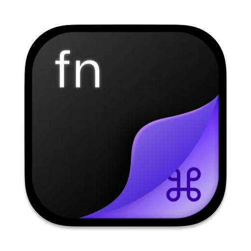 WindowKeys | 2.0 |
|  Windows App | 11.1.5 |
|  Windsurf | 1.8.2 |
|  WineHQ-stable | 10.0 |
| 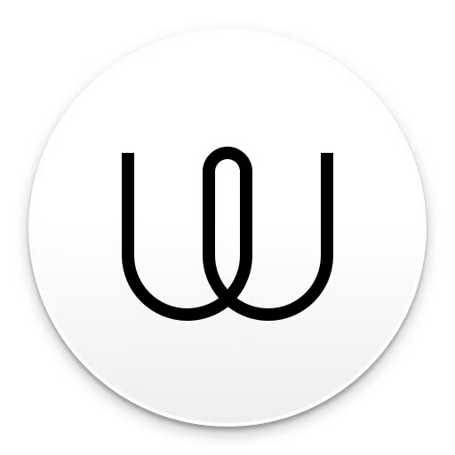 Wire | 3.40.5285 |
|  Wireshark | 4.4.6 |
|  Witch | 4.6.2 |
| 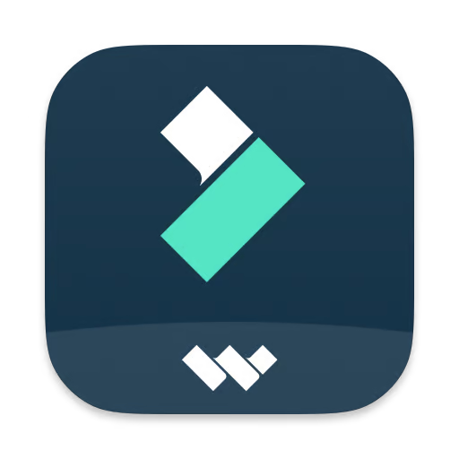 Wondershare Filmora | 13.0.25 |
| 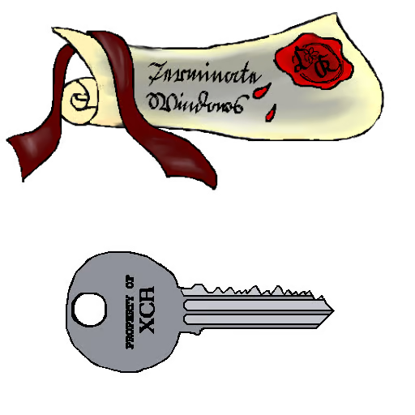 XCA | 2.9.0 |
|  XMind | 25.01.01061-202501070704 |
| 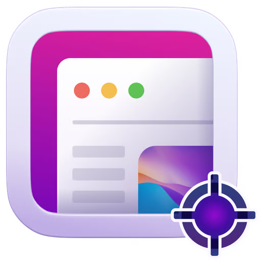 Xnapper | 1.17.1 |
|  Yaak | 2025.1.2 |
|  Yubikey Manager | 1.2.5 |
|  Zed | 0.185.13 |
|  Zed Attack Proxy | 2.16.1 |
|  Zen Browser | 1.12.3b |
|  Zenmap | 7.96 |
|  Zoom | 6.4.6.53970 |

> [!NOTE]
> Missing an app? Feel free to [request additional app support](https://github.com/ugurkocde/IntuneBrew/issues/new?labels=app-request) by creating an issue!

## üîß Configuration

First decide which authentication method you would like to use. There are currently the following methods implemented:

- System Managed Identity
- User Managed Identity
- ClientSecret & ClientID using App Registration
- Certificate based authentication

### Using System Managed Identity

1. Open your Automation Account and select Account Settings -> Identity.
2. Turn Status on tab "System assigned" to "On".
3. Add the following API permissions to your System Managed Identity using this PowerShell script: [Microsoft Tech Community](https://techcommunity.microsoft.com/blog/integrationsonazureblog/grant-graph-api-permission-to-azure-automation-system-assigned-managed-identity/4278846)
   - DeviceManagementApps.ReadWrite.All
4. Open [Entra admin center](https://entra.microsoft.com/#view/Microsoft_AAD_IAM/StartboardApplicationsMenuBlade/~/AppAppsPreview) -> Applications -> Enterprise Applications. Change Filter "Application type" to "Managed Identities" and search for your Automation Account name. Open the entity.
5. Verify that the right permissions are set to the Managed Identity in the Security -> Permissions tab.
6. Create a new Variable in your Automation Account with the name "AuthenticationMethod" and value "SystemManagedIdentity" to use the System Managed Identity.

### Using User Assigned Managed Identity

1. Open [Azure Portal](https://portal.azure.com) and search for "Managed Identities".
2. Click "Create" and select your Azure Subscription & Resource group. Choose your region and set a name for the identity.
3. Open your Automation Account and select Account Settings -> Identity.
4. Switch to tab "User assigned" and click "Add". Choose the previously created Managed Identity.
5. Add the following API permissions to your System Managed Identity using this PowerShell script: [Microsoft Tech Community](https://techcommunity.microsoft.com/blog/integrationsonazureblog/grant-graph-api-permission-to-azure-automation-system-assigned-managed-identity/4278846)
   - DeviceManagementApps.ReadWrite.All
6. Open [Entra admin center](https://entra.microsoft.com/#view/Microsoft_AAD_IAM/StartboardApplicationsMenuBlade/~/AppAppsPreview) -> Applications -> Enterprise Applications. Change Filter "Application type" to "Managed Identities" and search for your Automation Account name. Open the entity.
7. Verify that the right permissions are set to the Managed Identity in the Security -> Permissions tab.
8. Create a new Variable in your Automation Account with the name "AuthenticationMethod" and value "UserAssignedManagedIdentity" to use the User Assigned Managed Identity.

### Using ClientSecret from Entra ID App Registration

1. Create a new App Registration in Azure
2. Add the following API permissions:
   - DeviceManagementApps.ReadWrite.All
3. Update the parameters in the script with your Azure details.
   - $appid = '<YourAppIdHere>' # App ID of the App Registration
   - $tenantid = '<YourTenantIdHere>' # Tenant ID of your EntraID
   - $certThumbprint = '<YourCertificateThumbprintHere>' # Thumbprint of the certificate associated with the App Registration

### Certificate-Based Authentication

1. Generate a self-signed certificate:

```powershell
$cert = New-SelfSignedCertificate -Subject "CN=IntuneBrew" -CertStoreLocation "Cert:\CurrentUser\My" -KeyExportPolicy Exportable -KeySpec Signature -KeyLength 2048 -KeyAlgorithm RSA -HashAlgorithm SHA256 -NotAfter (Get-Date).AddYears(2)
```

2. Export the certificate:

```powershell
$pwd = ConvertTo-SecureString -String "YourPassword" -Force -AsPlainText
Export-PfxCertificate -Cert $cert -FilePath "IntuneBrew.pfx" -Password $pwd
```

3. Upload to Azure App Registration:
   - Go to your App Registration in Azure Portal
   - Navigate to "Certificates & secrets"
   - Upload the public key portion of your certificate

### Copy Assignments

Using the `-CopyAssignments` switch with `IntuneBrew.ps1` or creating a `CopyAssignments` Variable with Boolean Value `true` in your Azure Automation indicates that assignments from the existing app version should be copied to the new version.

### App JSON Structure

Apps are defined in JSON files with the following structure:

```json
{
  "name": "Application Name",
  "description": "Application Description",
  "version": "1.0.0",
  "url": "https://download.url/app.dmg",
  "bundleId": "com.example.app",
  "homepage": "https://app.homepage.com",
  "fileName": "app.dmg"
}
```

## 🔄 Version Management

IntuneBrew implements sophisticated version comparison logic:

- Handles various version formats (semantic versioning, build numbers)
- Supports complex version strings (e.g., "1.2.3,45678")
- Manages version-specific updates and rollbacks
- Provides clear version difference visualization

Version comparison rules:

1. Main version numbers are compared first (1.2.3 vs 1.2.4)
2. Build numbers are compared if main versions match
3. Special handling for complex version strings with build identifiers

## 🛠️ Error Handling

IntuneBrew includes robust error handling mechanisms:

1. **Upload Retry Logic**

   - Automatic retry for failed uploads (up to 3 attempts)
   - Exponential backoff between retries
   - New SAS token generation for expired URLs

2. **File Processing**

   - Temporary file cleanup
   - Handle locked files
   - Memory management for large files

3. **Network Issues**

   - Connection timeout handling
   - Bandwidth throttling
   - Resume interrupted uploads

4. **Authentication**
   - Token refresh handling
   - Certificate expiration checks
   - Fallback to interactive login

## 🤔 Troubleshooting

### Common Issues

1. **File Access Errors**

   - Ensure no other process is using the file
   - Try deleting temporary files manually
   - Restart the script

2. **Upload Failures**

   - Check your internet connection
   - Verify Azure AD permissions
   - Ensure file sizes don't exceed Intune limits

3. **Authentication Issues**
   - Verify your Azure AD credentials
   - Check tenant ID configuration
   - Ensure required permissions are granted

## 🤝 Contributing

Contributions are welcome! Please feel free to submit a Pull Request. For major changes, please open an issue first to discuss what you would like to change.

1. Fork the Project
2. Create your Feature Branch (`git checkout -b feature/AmazingFeature`)
3. Commit your Changes (`git commit -m 'Add some AmazingFeature'`)
4. Push to the Branch (`git push origin feature/AmazingFeature`)
5. Open a Pull Request

## üìú License

This project is licensed under the MIT License - see the [LICENSE](LICENSE) file for details.

## üôè Acknowledgments

- Thanks to all contributors who have helped shape IntuneBrew
- Microsoft Graph API documentation and community
- The PowerShell community for their invaluable resources

## üìû Support

If you encounter any issues or have questions:

1. Check the [Issues](https://github.com/ugurkocde/IntuneBrew/issues) page
2. Review the troubleshooting guide
3. Open a new issue if needed

---

Made with ❤️ by [Ugur Koc](https://github.com/ugurkocde)
